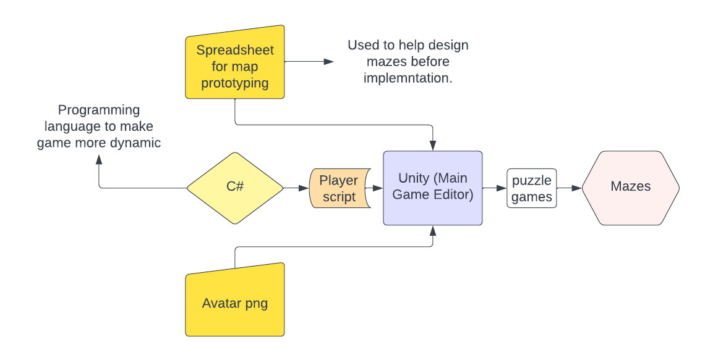

# Puzzle Islands
## CS345 Project 2
## By Oluwademilade Bolatimi, Tobias Dean & Katrina Ziebarth

## Introduction:

Welcome to our unity project, Puzzle Islands. This is a 2D puzzle focused exploration game for WebGL in which the player controls a ship exploring a chain of island mazes, collecting gold and raising their score. The player's main objective is to get from the start to the final island with as high of a score as possible. After completing a maze, the player will proceed to the next maze.

## Software Used:

- Unity Version 2021.3.21f1
- C#

## Software Architecture Diagram:

## Instructions on how to test game:

- Clone github repository onto local machine or machine of choice.
- Load folder using unity hub (version must be 2021.3.21f1!)
- Go to the 1-1 file in the Assets/Scenes folder and press play with unity ui.

### Building the game:

- Go to file
- Go to build settings
- Select webgl on left side of screen
- hit build 
    - if build option not working hit swith platform, wait for load then hit build.

## Assets Folder Description:

- Audio - folder contains sounds for the game.
    - Gold Pick up - contains sounds for collisions with gold coins.
    - Background music - contains sounds for background music of all the levels of the game.
- Animations - contains gold coin and player animations.
- Collectibles - contains gold coin prefab and destination prefab.
- Scenes - All the different scenes/levels of our game.
- TextMesh Pro - built in with unity.
- Tilemaps - contains all the tile maps that we used to build our mazes.
- UIScrolls - Has all the credits, intro scroll and the original score assets.
- PlayerBehavior.cs - Script used to control player behavior, world intercation and updates the players UI.

